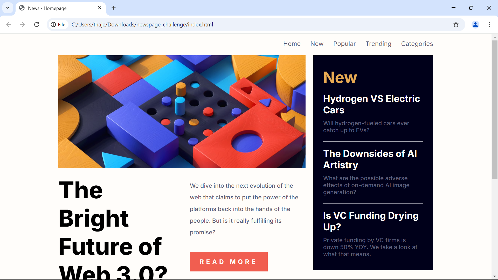
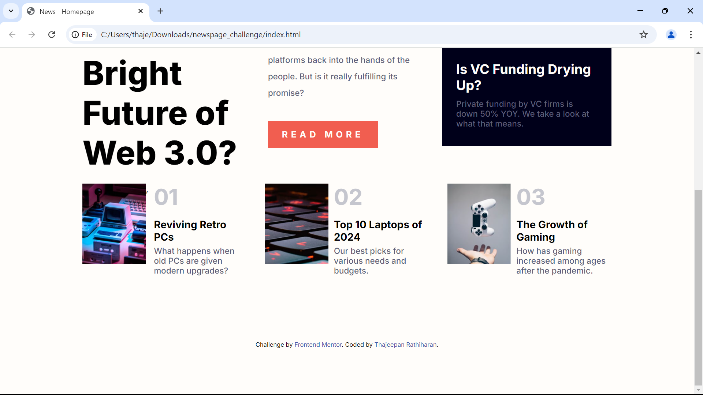
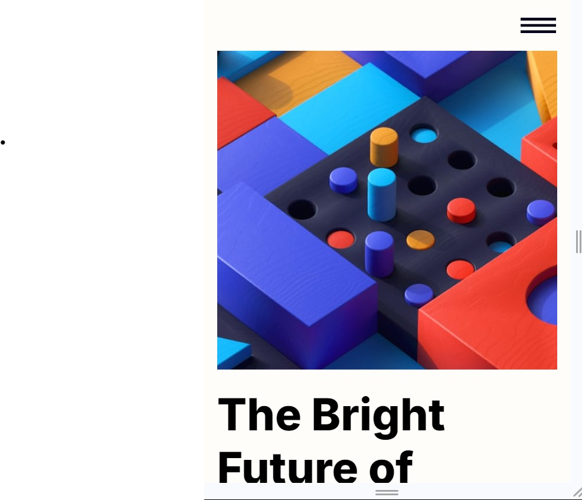
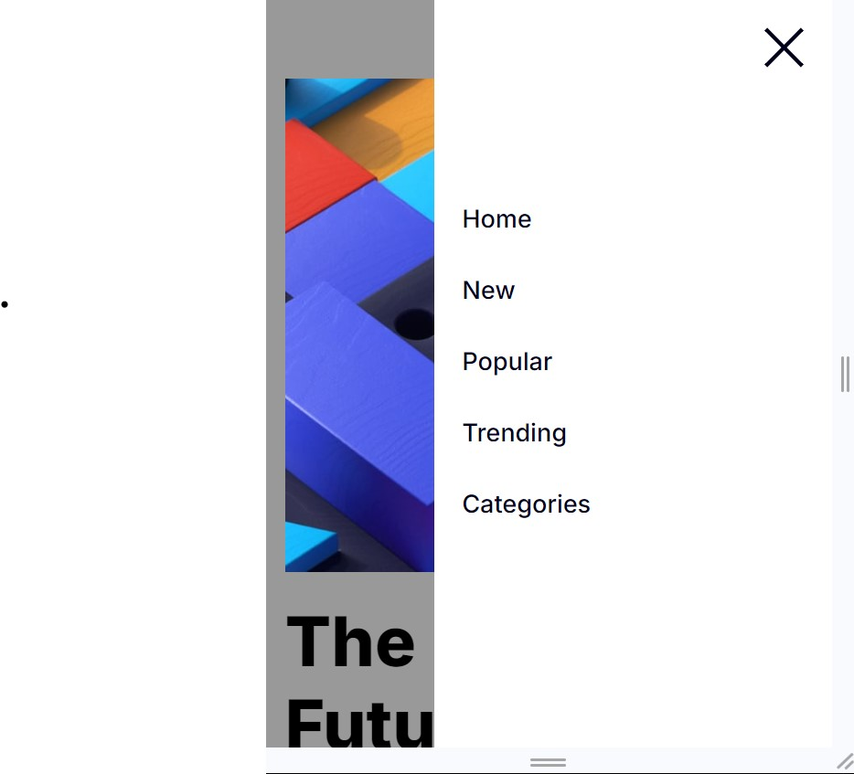

# Dummy News Homepage

## [Link to my result](https://thajeepan-rathiharan.github.io/News_Homepage/)

This is my repository for the News homepage [coding challenge by Frontend Mentor](https://www.frontendmentor.io/challenges/news-homepage-H6SWTa1MFl).

## Coding languages used:
- HTML
- CSS
- JavaScript

## Screenshots:
- Screenshot of the top half of the page on a desktop device.

- Screenshot of the bottom half of the page on a desktop device.

- Screenshot of the page on a mobile device with the burger menu icon.
 

- Screenshot of the burger menu open on a mobile device.
 